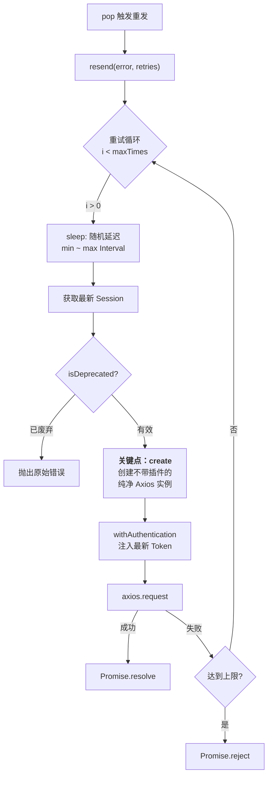

重试补偿流程：

```mermaid
flowchart TD
    Pop[pop 触发重发] --> Resend["resend(error, retries)"]
    Resend --> Loop{重试循环<br/>i < maxTimes}
    
    Loop -- "i > 0" --> Sleep[sleep: 随机延迟<br/>min ~ max Interval]
    Sleep --> GetSession[获取最新 Session]
    
    GetSession --> CheckDep{isDeprecated?}
    CheckDep -- "已废弃" --> Throw[抛出原始错误]
    
    CheckDep -- "有效" --> CreateAxios[<b>关键点：create</b><br/>创建不带插件的<br/>纯净 Axios 实例]
    
    CreateAxios --> Auth[withAuthentication<br/>注入最新 Token]
    Auth --> Request[axios.request]
    
    Request -- "成功" --> Resolve[Promise.resolve]
    Request -- "失败" --> Retry{达到上限?}
    Retry -- "否" --> Loop
    Retry -- "是" --> Reject[Promise.reject]
```