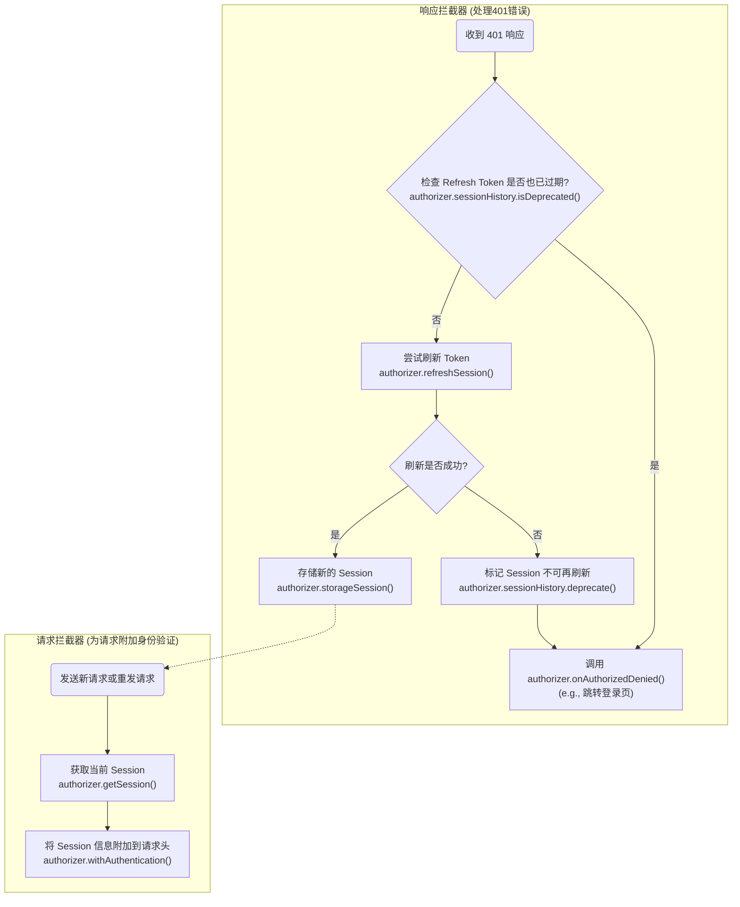

# 装饰器可用性

下表总结了各个装饰器的使用范围。

| 装饰器 | 可用范围 | 描述 |
| :--- | :--- | :--- |
| `@RequestConfig` | 类 / 方法 | 设置请求配置（例如 `timeout`, `headers`）。 |
| `@RequestMapping` | 类 / 方法 | 定义 URL 路径和 HTTP 请求方法。 |
| `@RequestWith` | 方法 | 覆盖或扩展特定于方法的配置。 |
| `@RequestBody` | 方法 | 标记一个参数作为请求体。 |
| `@RequestHeader` | 方法 | 标记一个参数作为请求头发送。 |
| `@RequestParam` | 方法 | 标记一个参数作为 URL 查询参数发送。 |

---

# Authorizer 方法调用流程

以下流程图描述了在会话过期和认证流程中, `AuthorizationPlugin` 是如何调用 `Authorizer` 接口的各个方法的。

