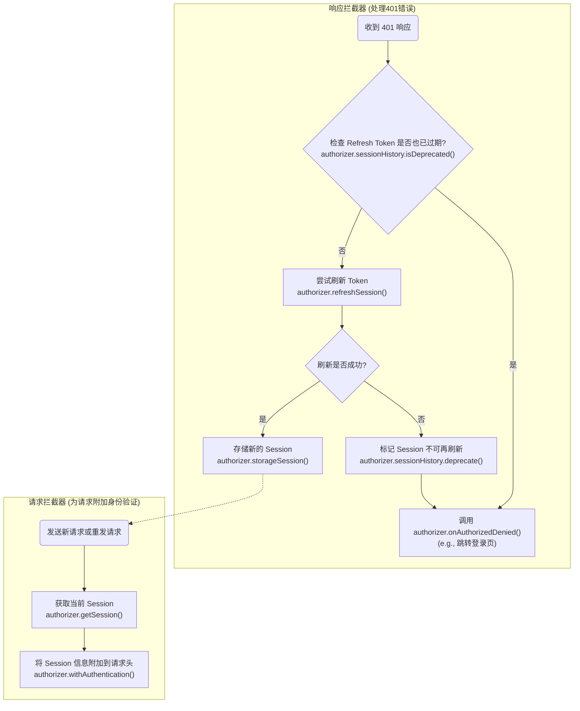

# 装饰器可用性

下表总结了各个装饰器的使用范围。

| 装饰器 | 可用范围 | 描述 |
| :--- | :--- | :--- |
| `@RequestConfig` | 类 / 方法 | 设置请求配置（例如 `timeout`, `headers`）。 |
| `@RequestMapping` | 类 / 方法 | 定义 URL 路径和 HTTP 请求方法。 |
| `@RequestWith` | 方法 | 覆盖或扩展特定于方法的配置。 |
| `@RequestBody` | 方法 | 标记一个参数作为请求体。 |
| `@RequestHeader` | 方法 | 标记一个参数作为请求头发送。 |
| `@RequestParam` | 方法 | 标记一个参数作为 URL 查询参数发送。 |
| `@PathVariables` | 方法 | 标记一个参数作为 URL 路径变量。 |

---

# Authorizer 方法调用流程

以下流程图描述了在会话过期和认证流程中, `AuthorizationPlugin` 是如何调用 `Authorizer` 接口的各个方法的。



---

# 用法与核心理念

本库的设计哲学是将 **请求的构建声明** 与 **业务数据的提供** 完全分离。作为开发者，你不再需要手动拼装 URL、请求头和请求体，而是通过装饰器来“声明”一个请求应该如何被构建。

## 核心流程

1.  **声明式构建**：你使用 `@RequestMapping`, `@RequestParam` 等装饰器来描述一个请求的静态结构。
2.  **提供数据源**：你的业务方法接收参数，并 `return` 一个由这些参数组装成的普通 JavaScript 对象。这个对象将作为所有装饰器的数据源 (Data Source)。
3.  **自动执行**：框架会拦截你的方法调用，使用装饰器定义的规则，从你返回的数据源对象中提取数据，自动构建并执行 Axios 请求。

## `Expect<T>` 的作用：连接静态类型与运行时行为

由于 TypeScript 的限制，装饰器无法在编译时改变一个方法的返回类型。你的方法在代码层面返回的是一个普通对象（数据源），但框架在运行时实际返回的是一个 `AxiosPromise`。

`Expect<T>` 的作用就是解决这个“类型不匹配”的问题。它是一个类型桥梁，在编译时“欺骗”TypeScript 编译器，从而让你在调用代码时能够获得完整的类型安全和 IDE 代码提示。

### `Expect<T>` 中的泛型 `T`

你传递给 `Expect<T>` 的泛型 `T` 至关重要，它 **定义了你期望服务器响应体 `data` 的类型**。

-   如果接口返回一个具体的 JSON 对象，你应该为其定义一个接口 `MyData` 并使用 `Expect<MyData>(...)`。
-   如果接口返回纯文本，你应该使用 `Expect<string>(...)`。

## 用法示例

```typescript
import { Service, RequestConfig, RequestMapping, RequestParam, Expect } from "axios-annotations";
import type { AxiosPromise } from "axios";

// 1. 定义我们期望从服务器得到的最终数据类型
interface UserProfile {
    id: number;
    name: string;
    email: string;
}

@RequestConfig({ baseURL: 'https://api.example.com' })
export class UserService extends Service {

    @RequestMapping("/users", "GET")
    // 装饰器声明了请求需要 'userId' 和 'includeDetails' 两个查询参数
    @RequestParam("userId")
    @RequestParam("includeDetails")
    getUserProfile(userId: number, includeDetails: boolean): AxiosPromise<UserProfile> { // 2. 方法接收动态参数

        // 3. 方法体将接收到的参数组装成数据源对象
        const dataSource = {
            userId: userId,
            includeDetails: includeDetails
        };

        // 4. 使用 Expect<UserProfile>(...) 来包装数据源，并匹配返回类型
        return Expect<UserProfile>(dataSource);
    }
}

// --- 如何调用 ---
const service = new UserService();

// 5. 调用时传入具体的参数值
service.getUserProfile(456, true).then(response => {
    // response.data 被正确推断为 UserProfile 类型
    console.log(response.data.name); 
});
```

### 参数装饰器的三种模式

`@RequestParam` 和 `@RequestHeader` 都支持以下三种灵活的配置模式，它们都作用于你从方法体中返回的 **数据源对象**。

#### 1. 简单用法 (按键名映射)

从数据源对象中查找同名的属性。

```typescript
// 会从数据源中寻找 `userId` 属性
@RequestParam("userId")
```

#### 2. 静态值用法

为请求参数赋予一个固定的静态值，无需从数据源中查找。

```typescript
@RequestParam({
    key: 'channel',
    value: 'web' 
})
```

#### 3. 动态函数用法

提供一个函数，该函数接收完整的数据源对象作为参数，用于动态计算参数的值。

```typescript
@RequestParam({
    key: 'timestamp',
    value: function (source) { // source 就是你方法体返回的那个对象
        return Date.now();
    }
})
```
