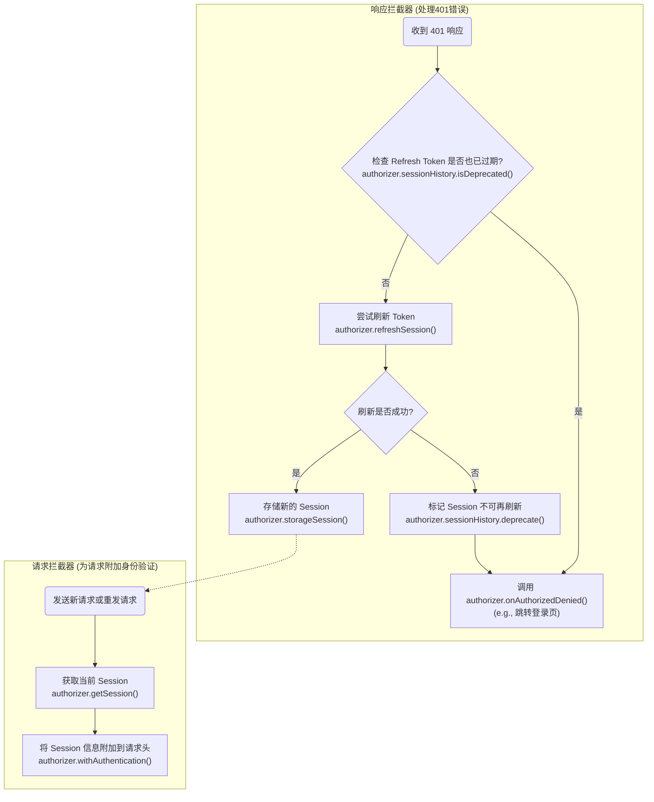

# Axios Annotations
Quick Configuration Framework without Typescript using axios.<br/>

声明式`API`配置工具。将 **请求的构建声明** 与 **业务数据的提供** 完全分离。不再手动拼装 `URL`、请求头和请求体，而是通过装饰器来“声明”一个请求应该如何被构建。

# 装饰器可用范围
| 装饰器 | 可用范围 | 描述                    |
| :--- | :--- |:----------------------|
| `@RequestConfig` | 类 / 方法 | 设置请求配置（例如 `signal`）。  |
| `@RequestMapping` | 类 / 方法 | 定义 `URL` 路径和 `HTTP` 请求方法。 |
| `@RequestWith` | 方法 | 重定向请求方法使用的配置。         |
| `@RequestBody` | 方法 | 标记一个参数作为请求体。          |
| `@RequestHeader` | 方法 | 标记一个参数作为请求头发送。        |
| `@RequestParam` | 方法 | 标记一个参数作为 `URL` 查询参数发送。  |
| `@PathVariables` | 方法 | 标记一个参数作为 `URL` 路径变量。    |
---

# Usage
## 流程简述
+ **声明式构建**：使用 `@RequestMapping`, `@RequestParam` 等装饰器来描述一个请求的静态结构。
+ **提供数据源**：业务方法接收参数，并 `return` 一个由这些参数组装成的普通 `JavaScript` 对象。这个对象将作为所有装饰器的数据源 (`Data Source`)。
+ **自动执行**：框架会拦截方法调用，使用装饰器定义的规则，从返回的数据源对象中提取数据，自动构建并执行请求。

## 创建配置
框架内置默认的全局配置，默认指向本地的`8080`端口，但建议自行创建和管理配置。
例：
```ts
// config.ts
import {Config} from "axios-annotations";

export const localConfig = new Config({
    protocol: 'http',
    host: 'localhost',
    prefix: '', // 请求前缀，可选
    port: 5173
});
```
通过 `@RequestConfig` 注入服务类，注意服务类需要继承 `Service`。
```ts
import {localConfig} from "./config.ts";
import {Service, RequestConfig} from "axios-annotations";

@RequestConfig(localConfig)
export class DemoService extends Service {
    // ...
}
```
请求前缀可以在 `Config` 的 `prefix` 中指定，或者使用 `@RequestMapping` 指定前缀。

## @RequestMapping
+ 声明服务使用的统一请求前缀。
+ 声明业务方法的请求方法和请求路径，注解方法的时候第二参数必填。
```ts
import {localConfig} from "./config.ts";
import {Expect, Service, RequestConfig, RequestMapping} from "axios-annotations";

@RequestConfig(localConfig)
@RequestMapping("/api")
export class DemoService extends Service {
    // [GET] http://localhost:5173/api/foo
    @RequestMapping("/foo", "GET")
    foo() {
        return Expect<Record<any>>({});
    }

    // [POST] http://localhost:5173/api/bar
    @RequestMapping("/bar", "POST")
    bar() {
        return Expect<Record<any>>({});
    }
}
```

## @RequestWith
+ 重定向方法使用的配置，服务类的业务划分需要用到不同的服务器地址。
例子，请求不同服务器的文件：
```ts
import {Config, Expect, Service, RequestConfig, RequestMapping, RequestWith} from "axios-annotations";

const config = new Config({
    protocol: "http",
    host: "localhost",
    prefix: "/resources",
    port: 5173
});

const config2 = new Config({
    protocol: "http",
    host: "localhost",
    prefix: "/data",
    port: 5173
});

@RequestConfig(config)
export class FileService extends Service {
    @RequestMapping("/test1.json", "GET")
    getFile() {
        // [GET] http://localhost:5173/resources/test1.json
        return Expect<any>({
            params: {}
        });
    }

    @RequestWith(config2)
    @RequestMapping("/test2.json", "GET")
    getFile2() {
        // [GET] http://localhost:5173/data/test2.json
        return Expect<any>({
            params: {}
        });
    }
}
```
注意，如果服务类使用 `@RequestMapping` 声明了统一前缀，那么使用 `@RequestWith` 重定向仍然会拼接服务类的统一前缀。
如果需要服务类方法使用不同的请求前缀，你可能需要将服务的统一前缀提升到 `Config` 的 `prefix` 字段或者取消前缀相关配置。
```ts
// ...config

const config2 = new Config({
    protocol: "http",
    host: "localhost",
    prefix: "/data",
    port: 5173
});

@RequestConfig(config)
@RequestMapping("/api")
export class FileService extends Service {
    // ...
    
    @RequestWith(config2)
    @RequestMapping("/test2.json", "GET")
    getFile2() {
        // [GET] http://localhost:5173/data/api/test2.json
        return Expect<any>({
            params: {}
        });
    }
}
```

## @RequestBody
+ 仅用于声明请求体的取值字段，默认不传则为 `"body"` 字段, `@RequestBody()` 跟 `@RequestBody("body")` 等价：
注意请求体声明因类型问题无法合并，多次声明请求体取值以最后执行的为准。
```ts
@RequestConfig(config)
@RequestMapping("/api")
export class FileService extends Service {
    // ...
    @RequestMapping("/files/package_graph.json", "POST")
    @RequestBody()
    getPackageGraph() {
        return Expect<Record<string, any>>({
            body: {
                version: '3.x',
                description: '示例数据'
            }
        });
    }
}
```
`@RequestBody` 的扩展写法，用于指定静态值或自定义取值逻辑。
指定静态值：
```ts
@RequestConfig(config)
export class FileService extends Service {
    // ...
    @RequestMapping("/files/package_graph.json", "POST")
    @RequestBody({
        value: {
            version: '3.x',
            description: '示例数据'
        }
    })
    getPackageGraph() {
        return Expect<Record<string, any>>({});
    }
}
```
自定义取值逻辑:
```ts
@RequestConfig(config)
export class FileService extends Service {
    // ...
    @RequestMapping("/files/package_graph.json", "POST")
    @RequestBody({
        value: function () {
            return {
                version: '3.x',
                description: '示例数据2'
            };
        }
    })
    getPackageGraph() {
        return Expect<Record<string, any>>({});
    }
}
```
## @RequestHeader
声明请求头的取值，有以下的取值方式：
+ 声明数据源字段，`@RequestHeader(key: string, required?: boolean = true)` 第二参数默认必填，空值（`null` / `undefined` / `''`）默认设置空字符串
+ 声明静态值
+ 声明自定义取值逻辑
请求头取值可合并，所以这里一次性给出取值示例：
```ts
@RequestConfig(config)
export class FileService extends Service {
    // ...
    // 声明数据源字段，且必填
    @RequestHeader("Custom-Header", true)
    // 声明静态值
    @RequestHeader({
        key: "Custom-Header-2",
        value: "static-header-value",
        required: true, // 只要你不给 value 传空值该字段就没有意义
    })
    // 声明自定义取值逻辑
    @RequestHeader({
        key: "Custom-Header-3",
        value: function (source: Record<string, any>) {
            return source.num1 + source.num2;
        }
    })
    getPackageGraph() {
        return Expect<Record<string, any>>({
            "Custom-Header": "header-value-from-source",
            num1: 100,
            num2: 200
        });
    }
}
```
生成的请求头为：
```
Custom-Header:       header-value-from-source
Custom-Header-2:     static-header-value
Custom-Header-3:     300
```

## @RequestParam
声明查询参数的取值，取值方式用法跟请求头的声明类似，此处不再啰嗦：
+ 声明数据源字段，`@RequestParam(key: string, required?: boolean = false)` 第二参数默认选填，空值不会拼接到请求地址。
+ 声明静态值，键值 `key` 必填。
+ 声明自定义取值逻辑， 键值 `key` 必填。
```ts
const config = new Config({
    protocol: "http",
    host: "localhost",
    prefix: "/resources",
    port: 5173
});

@RequestConfig(config)
export class FileService extends Service {
    @RequestMapping("/demo.json", "POST")
    @RequestParam("param1") // 基本形式
    @RequestParam("param2") // 基本形式
    // 扩展写法（函数）
    @RequestParam({
        key: "sum",
        value: function (source: Record<string, any>) {
            return Number(source['param1']) + Number(source['param2']);
        }
    })
    // 扩展写法（静态值）
    @RequestParam({
        key: 'static',
        value: 'foo'
    })
    @RequestBody()
    getJson() {
        return Expect<Record<string, any>>({
            param1: '114',
            param2: '514',
            body: {
                employees: [
                    {
                        firstName: "John",
                        lastName: "Doe"
                    }
                ]
            }
        });
    }
}
```
调用 `getJson` 生成的地址：
```text
http://localhost:5173/resources/demo.json?static=foo&sum=628&param2=514&param1=114
```

## @PathVariables
启用路径参数，从数据源或数据源字段中取值，取值必须为 `PlainObject`，替换 `url` 中的占位符。
启用路径参数请至少确保有一个 `@PathVariables` 声明，不指定路径参数数据源字段时，直接从数据源本体取值。
由于路径参数声明取值可合并，此处给出所有取值示例：
```ts
export const localConfig = new Config({
    protocol: 'http',
    host: 'localhost',
    port: 5173
});

@RequestConfig(config)
export class FileService extends Service {
    @RequestMapping("/files/{fileName}?a={a}&c={c}&e={e}", "GET")
    @PathVariables() // 不指定字段，从数据源本体取值，此处会查询出 "fileName" 的取值
    @PathVariables({
        // 自定义数据源生成逻辑
        value: function (source: Record<string, any>) {
            return {
                a: 100,
                c: 300,
                d: source.d
            }
        }
    })
    // 此处 pathVariablesKey 的值会跟数据源本体合并为一个新的对象，所以会查询出 "e"
    @PathVariables('pathVariablesKey') // => "e"
    // 注意这个是查询参数，生成逻辑跟路径参数不一样
    @RequestParam({
        key: 'b',
        value: 200
    })
    getFileInfo(fileName: string) {
        return Expect<Record<string, any>>({
            fileName,
            d: 400,
            pathVariablesKey: {
                e: 500
            }
        });
    }
}
```
路径参数可用于查询参数的填充，但跟 `@RequestParam` 的区别：
+ `@RequestParam` 合并值直接传给 `axios` 的 `params` 参数，对于数组等符合类型，使用 `axios` 的生成逻辑，路径参数则直接转为 `JSON` 字符串，所以不要传非基本类型。
+ 占位符是固定的字符序列，没有所谓选填逻辑。
+ 转换非基本类型失败一律转为 `"undefined"`。

## @RequestConfig
+ 注解类时，用于设置服务类使用的配置。
+ 注解方法时，合并 `AxiosRequestConfig` 配置，例如有 `N` 个查询参数/请求头不想一个个配置，可以使用 `@RequestConfig` 统一返回。
```ts
const config = new Config({
    protocol: "http",
    host: "localhost",
    prefix: "/data",
    port: 5173
});

@RequestConfig(config)
export class FileService extends Service {
    @RequestMapping("/test1.json", "GET")
    @RequestConfig({
        headers: {
            'X-Source': 'class',
            'Authorization': 'Bearer token'
        }
    })
    @RequestConfig(function (source: Record<string, any>) {
        return {
            headers: {
                'Token1': '1'
            },
            params: source.params
        };
    })
    getData() {
        // http://localhost:5173/data/test1.json?a=1&b=2
        // ----
        // Headers:
        // 
        // X-Source:         class
        // Token1:           1
        // Authorization:    Bearer token
        return Expect<Record<string, any>>({
            params: {
                'a': 1,
                'b': 2
            }
        });
    }
}
```
`@RequestConfig` 可用于注入 `AbortController` 或 `CancelToken` 中断源：
```ts
@RequestConfig(config)
export class FileService extends Service {
    @RequestMapping("/test1.json", "GET")
    @RequestConfig(function (source: Record<string, any>) {
        return {
            signal: source.signal
        };
    })
    getData(signal: AbortSignal) {
        return Expect<Record<string, any>>({
            signal
        });
    }
}

// 调用
const ApiManager = {
    fileService: new FileService()
}

const signal = AbortSignal.timeout(30000);
signal.addEventListener('abort', () => {
   console.log('超时，强制取消请求'); 
});

ApiManager.fileService.getData(signal);
```

## Expect
函数原型参考：
```typescript
export default function Expect<T, D = AxiosPromise<T>>(params: any): D;
```
由于 `TypeScript` 的限制，装饰器无法在编译时改变一个方法的返回类型。方法在代码层面返回的是一个普通对象（数据源），但框架在运行时实际返回的是一个 `AxiosPromise`。
`Expect<T>` 的作用就是解决这个“类型不匹配”的问题。它是一个类型桥梁，绕过类型检查，从而让你在调用代码时能够获得完整的类型安全和 `IDE` 代码提示。
`Expect<T>` 的泛型 `T` 至关重要，它 **定义了你期望服务器响应体 `data` 的类型**。
-   如果接口返回一个具体的 `JSON` 对象，你应该为其定义一个接口 `MyData` 并使用 `Expect<MyData>(...)`。
-   如果接口返回纯文本，你应该使用 `Expect<string>(...)`。

# Authorizer 方法调用流程

以下流程图描述了在会话过期和认证流程中, `AuthorizationPlugin` 是如何调用 `Authorizer` 接口的各个方法的。


