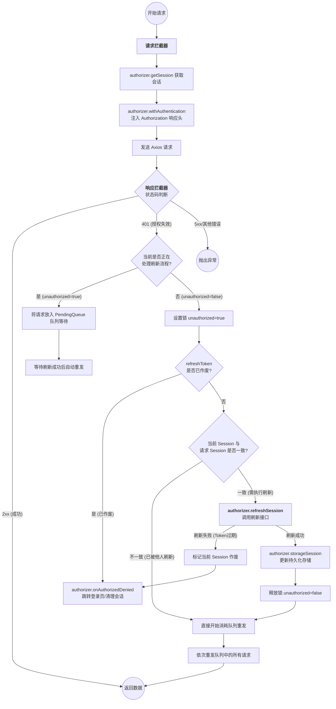

# Axios Annotations 
version <kbd>3.0</kbd>
> Quick Configuration Framework without Typescript using axios.
> 声明式`API`配置工具。将 **请求的构建声明** 与 **业务数据的提供** 完全分离。不再手动拼装 `URL`
、请求头和请求体，而是通过装饰器来“声明”一个请求应该如何被构建。

# 装饰器可用范围

| 装饰器               | 可用范围   | 描述                        |
|:------------------|:-------|:--------------------------|
| `@RequestConfig`  | 类 / 方法 | 设置请求配置（例如 `signal`）。      |
| `@RequestMapping` | 类 / 方法 | 定义 `URL` 路径和 `HTTP` 请求方法。 |
| `@RequestWith`    | 方法     | 重定向请求方法使用的配置。             |
| `@RequestBody`    | 方法     | 标记一个参数作为请求体。              |
| `@RequestHeader`  | 方法     | 标记一个参数作为请求头发送。            |
| `@RequestParam`   | 方法     | 标记一个参数作为 `URL` 查询参数发送。    |
| `@PathVariables`  | 方法     | 标记一个参数作为 `URL` 路径变量。      |

---

# Usage

## 流程简述

+ **声明式构建**：使用 `@RequestMapping`, `@RequestParam` 等装饰器来描述一个请求的静态结构。
+ **提供数据源**：业务方法接收参数，并 `return` 一个由这些参数组装成的普通 `JavaScript`
  对象。这个对象将作为所有装饰器的数据源 (`Data Source`)。
+ **自动执行**：框架会拦截方法调用，使用装饰器定义的规则，从返回的数据源对象中提取数据，自动构建并执行请求。

## 创建配置

框架内置默认的全局配置，默认指向本地的`8080`端口，但建议自行创建和管理配置。
例：

```ts
// config.ts
import {Config} from "axios-annotations";

export const localConfig = new Config({
    protocol: 'http',
    host: 'localhost',
    prefix: '', // 请求前缀，可选
    port: 5173
});
```

通过 `@RequestConfig` 注入服务类，注意服务类需要继承 `Service`。

```ts
import {localConfig} from "./config.ts";
import {Service, RequestConfig} from "axios-annotations";

@RequestConfig(localConfig)
export class DemoService extends Service {
    // ...
}
```

请求前缀可以在 `Config` 的 `prefix` 中指定，或者使用 `@RequestMapping` 指定前缀。

## @RequestMapping

+ 声明服务使用的统一请求前缀。
+ 声明业务方法的请求方法和请求路径，注解方法的时候第二参数必填。

```ts
import {localConfig} from "./config.ts";
import {Expect, Service, RequestConfig, RequestMapping} from "axios-annotations";

@RequestConfig(localConfig)
@RequestMapping("/api")
export class DemoService extends Service {
    // [GET] http://localhost:5173/api/foo
    @RequestMapping("/foo", "GET")
    foo() {
        return Expect<Record<any>>({});
    }

    // [POST] http://localhost:5173/api/bar
    @RequestMapping("/bar", "POST")
    bar() {
        return Expect<Record<any>>({});
    }
}
```

## @RequestWith

+ 重定向方法使用的配置，服务类的业务划分需要用到不同的服务器地址。
  例子，请求不同服务器的文件：

```ts
import {Config, Expect, Service, RequestConfig, RequestMapping, RequestWith} from "axios-annotations";

const config = new Config({
    protocol: "http",
    host: "localhost",
    prefix: "/resources",
    port: 5173
});

const config2 = new Config({
    protocol: "http",
    host: "localhost",
    prefix: "/data",
    port: 5173
});

@RequestConfig(config)
export class FileService extends Service {
    @RequestMapping("/test1.json", "GET")
    getFile() {
        // [GET] http://localhost:5173/resources/test1.json
        return Expect<any>({
            params: {}
        });
    }

    @RequestWith(config2)
    @RequestMapping("/test2.json", "GET")
    getFile2() {
        // [GET] http://localhost:5173/data/test2.json
        return Expect<any>({
            params: {}
        });
    }
}
```

注意，如果服务类使用 `@RequestMapping` 声明了统一前缀，那么使用 `@RequestWith` 重定向仍然会拼接服务类的统一前缀。
如果需要服务类方法使用不同的请求前缀，你可能需要将服务的统一前缀提升到 `Config` 的 `prefix` 字段或者取消前缀相关配置。

```ts
// ...config

const config2 = new Config({
    protocol: "http",
    host: "localhost",
    prefix: "/data",
    port: 5173
});

@RequestConfig(config)
@RequestMapping("/api")
export class FileService extends Service {
    // ...

    @RequestWith(config2)
    @RequestMapping("/test2.json", "GET")
    getFile2() {
        // [GET] http://localhost:5173/data/api/test2.json
        return Expect<any>({
            params: {}
        });
    }
}
```

## @RequestBody

+ 仅用于声明请求体的取值字段，默认不传则为 `"body"` 字段, `@RequestBody()` 跟 `@RequestBody("body")` 等价：
  注意请求体因类型问题无法合并，多次声明请求体取值以最后执行的为准。

```ts

@RequestConfig(config)
@RequestMapping("/api")
export class FileService extends Service {
    // ...
    @RequestMapping("/files/package_graph.json", "POST")
    @RequestBody()
    getPackageGraph() {
        return Expect<Record<string, any>>({
            body: {
                version: '3.x',
                description: '示例数据'
            }
        });
    }
}
```

`@RequestBody` 的扩展写法，用于指定静态值或自定义取值逻辑。
指定静态值：

```ts

@RequestConfig(config)
export class FileService extends Service {
    // ...
    @RequestMapping("/files/package_graph.json", "POST")
    @RequestBody({
        value: {
            version: '3.x',
            description: '示例数据'
        }
    })
    getPackageGraph() {
        return Expect<Record<string, any>>({});
    }
}
```

自定义取值逻辑:

```ts

@RequestConfig(config)
export class FileService extends Service {
    // ...
    @RequestMapping("/files/package_graph.json", "POST")
    @RequestBody({
        value: function () {
            return {
                version: '3.x',
                description: '示例数据2'
            };
        }
    })
    getPackageGraph() {
        return Expect<Record<string, any>>({});
    }
}
```

## @RequestHeader

声明请求头的取值，有以下的取值方式：

+ 声明数据源字段，`@RequestHeader(key: string, required?: boolean = true)` 第二参数`required`默认必填，`value`为空值时（`null` / `undefined` /`''`）默认转为空字符串。
+ 声明静态值，`key`必填。
+ 声明自定义取值逻辑，`key`必填。
  请求头取值可合并，所以这里一次性给出取值示例：

```ts

@RequestConfig(config)
export class FileService extends Service {
    // ...
    // 声明数据源字段，且必填
    @RequestHeader("Custom-Header", true)
    // 声明静态值
    @RequestHeader({
        key: "Custom-Header-2",
        value: "static-header-value",
        required: true,
    })
    // 声明自定义取值逻辑
    @RequestHeader({
        key: "Custom-Header-3",
        value: function (source: Record<string, any>) {
            return source.num1 + source.num2;
        }
    })
    getPackageGraph() {
        return Expect<Record<string, any>>({
            "Custom-Header": "header-value-from-source",
            num1: 100,
            num2: 200
        });
    }
}
```

生成的请求头为：

```
Custom-Header:       header-value-from-source
Custom-Header-2:     static-header-value
Custom-Header-3:     300
```

## @RequestParam

声明查询参数的取值，取值方式用法跟请求头的声明类似：

+ 声明数据源字段，`@RequestParam(key: string, required?: boolean = false)` 第二参数默认选填，空值不会拼接到请求地址。
+ 声明静态值， `key` 必填。
+ 声明自定义取值逻辑，  `key` 必填。

```ts
const config = new Config({
    protocol: "http",
    host: "localhost",
    prefix: "/resources",
    port: 5173
});

@RequestConfig(config)
export class FileService extends Service {
    @RequestMapping("/demo.json", "POST")
    @RequestParam("param1") // 基本形式
    @RequestParam("param2") // 基本形式
    // 扩展写法（函数）
    @RequestParam({
        key: "sum",
        value: function (source: Record<string, any>) {
            return Number(source['param1']) + Number(source['param2']);
        }
    })
    // 扩展写法（静态值）
    @RequestParam({
        key: 'static',
        value: 'foo'
    })
    @RequestBody()
    getJson() {
        return Expect<Record<string, any>>({
            param1: '114',
            param2: '514',
            body: {
                employees: [
                    {
                        firstName: "John",
                        lastName: "Doe"
                    }
                ]
            }
        });
    }
}
```

调用 `getJson` 生成的地址：

```text
http://localhost:5173/resources/demo.json?static=foo&sum=628&param2=514&param1=114
```

## @PathVariables

启用路径参数，从数据源或数据源字段中取值，取值必须为 `PlainObject`，替换 `url` 中的占位符。
启用路径参数请至少确保有一个 `@PathVariables` 声明，不指定路径参数数据源字段时，直接从数据源本体取值。
由于路径参数取值（`PlainObject`）可合并，此处给出所有取值示例：

```ts
export const localConfig = new Config({
    protocol: 'http',
    host: 'localhost',
    port: 5173
});

@RequestConfig(config)
export class FileService extends Service {
    @RequestMapping("/files/{fileName}?a={a}&c={c}&e={e}", "GET")
    @PathVariables() // 不指定字段，从数据源本体取值，此处会查询出 "fileName"
    @PathVariables({
        // 自定义数据源生成逻辑
        value: function (source: Record<string, any>) {
            return {
                a: 100,
                c: 300,
                d: source.d
            }
        }
    })
    // 此处 pathVariablesKey 的值会跟数据源本体合并为一个新的对象，所以会查询出 "e"
    @PathVariables('pathVariablesKey') // => "e"
    // 注意这个是查询参数，生成逻辑跟路径参数不一样
    @RequestParam({
        key: 'b',
        value: 200
    })
    getFileInfo(fileName: string) {
        return Expect<Record<string, any>>({
            fileName,
            d: 400,
            pathVariablesKey: {
                e: 500
            }
        });
    }
}
```

路径参数可用于查询参数的填充，但跟 `@RequestParam` 有区别：

+ `@RequestParam` 合并值直接传给 `axios` 的 `params` 参数，对于数组等符合类型，使用 `axios` 的生成逻辑，路径参数则直接转为
  `JSON` 字符串，所以不要传非基本类型。
+ 占位符是固定的字符序列，路径参数没有选填逻辑。
+ 转换非基本类型失败一律转为 `"undefined"`。

## @RequestConfig

+ 注解类时，用于设置服务类使用的配置。
+ 注解方法时，合并 `AxiosRequestConfig` 配置，例如有 `N` 个查询参数/请求头不想一个个配置，可以使用 `@RequestConfig` 统一返回。

```ts
const config = new Config({
    protocol: "http",
    host: "localhost",
    prefix: "/data",
    port: 5173
});

@RequestConfig(config)
export class FileService extends Service {
    @RequestMapping("/test1.json", "GET")
    @RequestConfig({
        headers: {
            'X-Source': 'class',
            'Authorization': 'Bearer token'
        }
    })
    @RequestConfig(function (source: Record<string, any>) {
        return {
            headers: {
                'Token1': '1'
            },
            params: source.params
        };
    })
    getData() {
        // http://localhost:5173/data/test1.json?a=1&b=2
        // ----
        // Headers:
        // 
        // X-Source:         class
        // Token1:           1
        // Authorization:    Bearer token
        return Expect<Record<string, any>>({
            params: {
                'a': 1,
                'b': 2
            }
        });
    }
}
```
`@RequestConfig` 可用于注入 `AbortController` 或 `CancelToken` 中断源。
众所周知，`React 18+`组件在开发环境下会重复挂载和卸载（`<React.StrictMode>`），导致 `useEffect(() => {}, [])` 中的请求会发送两次。
此处举例如何限制发送一次请求，即组件卸载时候自动取消请求：

```ts
@RequestConfig(config)
export class FileService extends Service {
  @RequestMapping("/test1.json", "GET")
  @RequestConfig(function (source: Record<string, any>) {
    return {
      signal: source.signal
    };
  })
  getData(signal: AbortSignal) {
    return Expect<Record<string, any>>({
      signal
    });
  }
}

// 管理你的服务实例
export const ApiManager = {
  fileService: new FileService()
}
```
`React`组件部分逻辑如下：
```tsx
import {ApiManager} from './api-manager'
import {useEffect} from "react";

export function ReactFunctionComponent() {
  useEffect(function () {
    const controller: AbortController = new AbortController();
    ApiManager.fileService.getData(controller.signal);

    return function () {
      controller.abort();
    };
  }, []);

  return (
          <div>
            <p>AbortController Demo</p>
            <p>开发环境下只有第二次挂载的请求会被接收</p>
          </div>
  );
}
```

## Expect

函数原型参考：

```typescript
export default function Expect<T, D = AxiosPromise<T>>(params: any): D;
```

由于 `TypeScript` 的限制，装饰器无法在编译时改变一个方法的返回类型。方法在代码层面返回的是一个普通对象（数据源），但框架在运行时实际返回的是一个`AxiosPromise`。
`Expect<T>` 的作用就是解决这个“类型不匹配”的问题。它是一个类型桥梁，绕过类型检查，从而让你在调用代码时能够获得完整的类型安全和`IDE` 代码提示。
`Expect<T>` 的泛型 `T` 至关重要，它 **定义了你期望服务器响应体 `data` 的类型**。

- 如果接口返回一个具体的 `JSON` 对象，你应该为其定义一个接口 `MyData` 并使用 `Expect<MyData>(...)`。

- 如果接口返回纯文本，你应该使用 `Expect<string>(...)`。

  


# 插件

## 自定义插件
插件函数接收配置对象为参数，出于扩展性考虑，通常由高阶函数返回。
插件在`Config`对象的`axios`实例创建时注入，建议在`Config`构造函数配置。
```typescript
import {Config} from "axios-annotations"
import type {AxiosInstance} from "axios";

export function ToastPlugin(fnToast) {
    return function (config: Config, axios: AxiosInstance) {
        axios.interceptors.response.use(function (e) {
            return Promise.resolve(e);
        }, function (e) {
            fnToast(e);
            return Promise.reject(e);
        });

        axios.interceptors.request.use(function (e) {
            return Promise.resolve(e);
        });
    }
}
```
配置插件：
```javascript
new Config({
    plugins: [
        ToastPlugin(function (e) {
        	if (typeof wx !== "undefined") {
                wx.showToast({
                    icon: "none",
                    title: `[${e.response.status}]` + ' ' + e.config.url
                });
            }
        })
    ]
})
```
## 授权插件
使用该插件用于自动为请求写入授权信息（自动携带`Bearer Token`请求头等），默认适配`OAuth2`标准，直接给出示例：
+ 定义会话存储器
```ts
class WebSessionStorage extends SessionStorage {
  async set(key: string, value: any): Promise<void> {
    return sessionStorage.setItem(key, JSON.stringify(value));
  }

  async get(key: string): Promise<any> {
    const str = sessionStorage.getItem(key);
    if (str) {
      return JSON.parse(str);
    } else {
      return null;
    }
  }

  async remove(key: string): Promise<void> {
    return sessionStorage.removeItem(key);
  }
}
```
+ 实例化并导出`Authorizer`对象，并注入`SessionStorage`
> 这里导出的`Authorizer`对象将用于首次登录后会话信息写入（调用`storageSession`）和获取会话（`getSession`）。
```ts
class LocalAuthorizer extends Authorizer {
  constructor() {
    super();
    this.sessionStorage = new WebSessionStorage();
  }

  // 刷新 access_token，这里直接返回修改后的 session 对象即可
  async refreshSession(session: BasicSession): Promise<any> {
    const response = await new OAuthService().refreshToken({
      refresh_token: session.refresh_token
    });
    console.log(`刷新 ${JSON.stringify(response.data)}`);
    // 此处组装新的 session 对象并返回, onAuthorizedDenied 会捕获该方法运行时异常
    return {
      ...response.data
    };
  }

  // 附加 session 字段到请求头
  withAuthentication(request: InternalAxiosRequestConfig, session: BasicSession) {
    // 这里使用默认实现，如果 refreshSession 返回 null, withAuthentication 的逻辑不会执行
    super.withAuthentication(request, session);
    console.log(request.headers);
  }

  // 会话刷新过程抛出异常
  // refresh_token 失效，约等于 refreshSession 返回 null
  async onAuthorizedDenied(error: unknown): Promise<void> {
    console.error(error); // 这个是 refreshSession 抛出的异常

    // 删除会话信息
    // 调用 invalidateSession 触发 onSessionInvalidated
    await this.invalidateSession();
  }

  onSessionInvalidated() {
    // 跳转回登录页/首页
    window.history.replaceState({}, document.title, window.location.pathname);
  }
}

export const authorizer = new LocalAuthorizer();
```
+ 定义授权链服务配置和业务链服务配置
授权链的接口应该跟业务链的接口分别独立`Service`，防止请求头冲突。
`OAuthService`示例代码适配`spring-boot-starter-oauth2-authorization-server 4.0.x`，仅供参考，看不懂可直接跳到`Authorizer`说明。
```ts
const oauthConfig = new Config({
  protocol: 'http',
  host: 'localhost',
  port: 8080
});

// 这里业务接口跟授权接口使用同一服务器
const businessConfig = new Config({
  protocol: 'http',
  host: 'localhost',
  port: 8080,
  plugins: [
    AuthorizationPlugin(authorizer)
  ]
});

@RequestConfig(oauthConfig)
export class OAuthService extends Service {
  // 随机字符串
  generateVerifier() {
    const array = new Uint32Array(56);
    window.crypto.getRandomValues(array);
    return Array.from(array, dec => ('0' + dec.toString(16)).slice(-2)).join('');
  }

  async getCodeChallenge(verifier: string) {
    const encoder = new TextEncoder();
    const data = encoder.encode(verifier);
    // 使用浏览器原生 Web Crypto API 进行 SHA-256 加密
    const digest = await window.crypto.subtle.digest('SHA-256', data);

    // Base64Url 编码 (注意：不是普通的 Base64)
    return btoa(String.fromCharCode(...new Uint8Array(digest)))
            .replace(/\+/g, '-')
            .replace(/\//g, '_')
            .replace(/=+$/, '');
  }

  // 根据 code 换取 accessToken 和 refreshToken
  @RequestMapping('/oauth2/token', 'POST')
  @RequestConfig(function (source) {
    const {signal, ...data} = source;
    return {
      headers: {
        'Authorization': 'Basic ' + btoa('test-client:test-secret'),
        'Content-Type': 'application/x-www-form-urlencoded'
      },
      signal: signal,
      data,
    }
  })
  getToken(params: {
    code_verifier: string;
    code: string;
    redirect_uri: string;
    signal?: AbortSignal
  }) {
    return Expect<{
      access_token: string;
      refresh_token: string;
    }>({
      signal: params.signal,
      grant_type: 'authorization_code',
      code: params.code,
      client_id: 'test-client',
      redirect_uri: params.redirect_uri,
      code_verifier: params.code_verifier
    });
  }

  // 刷新 accessToken
  @RequestMapping('/oauth2/token', 'POST')
  @RequestConfig(function (source) {
    const {signal, ...data} = source;
    return {
      headers: {
        'Authorization': 'Basic ' + btoa('test-client:test-secret'),
        'Content-Type': 'application/x-www-form-urlencoded'
      },
      signal: signal,
      data,
    }
  })
  refreshToken(params: {
    refresh_token: string;
    signal?: AbortSignal
  }) {
    return Expect<{
      "access_token": string;
      "refresh_token": string;
      "scope": string;
      "token_type": string;
      "expires_in": number;
    }>({
      signal: params.signal,
      grant_type: 'refresh_token',
      refresh_token: params.refresh_token,
      client_id: 'test-client'
    });
  }
}

// 业务接口
@RequestConfig(businessConfig)
export class BusinessService extends Service {
  // ... 全部省略
}
```
+ 登录并写入授权信息
```ts
const oauthService = new OAuthService();

async function handleLoginButtonClick() {
  const verifier = oauthService.generateVerifier();
  sessionStorage.setItem('code_verifier', verifier);
  const challenge = await oauthService.getCodeChallenge(verifier);
  const params = new URLSearchParams({
    response_type: 'code',
    client_id: 'test-client',
    scope: 'read',
    redirect_uri: 'http://localhost:5173',
    code_challenge: challenge,
    code_challenge_method: 'S256'
  });
  window.location.href = `http://localhost:8080/oauth2/authorize?${params.toString()}`
}

// 服务器回调的路由页面，这里直接用首页
useEffect(() => {
  const urlParams = new URLSearchParams(window.location.search);
  const code = urlParams.get('code');
  const controller = new AbortController();
  const verifier = sessionStorage.getItem('code_verifier');

  if (code && verifier) {
    oauthService.getToken({
      code: code,
      redirect_uri: 'http://localhost:5173',
      code_verifier: verifier,
      signal: controller.signal,
    }).then((response) => {
      const {access_token, refresh_token} = response.data;
      authorizer.storageSession({access_token, refresh_token}).then(() => {
        console.log({access_token, refresh_token});
      });
      // 消除地址栏的 code
      window.history.replaceState({}, document.title, window.location.pathname);
    }).catch(error => {
      if (error.name !== 'AbortError') console.error("Failed to get token:", error);
    });
  } else {
    authorizer.getSession().then(session => {
      // ...
    });
  }
  return () => controller.abort();
}, []);
```

## Authorizer
会话对象结构：
```ts
export type BasicSession = {
  access_token?: string;
  accessToken?: string;
  token?: string;

  refreshToken?: string;
  refresh_token?: string;
} & Record<string, any>;
```
非标准授权凭证需要映射到`access_token`/`accessToken`/`token`中的一个或多个字段。

非标准授权流程不支持`refreshToken`，可设置为不重复的随机值。

必须重载的方法只有`onAuthorizedDenied`、`refreshSession`。

**方法说明**：

+ invalidateSession(): Promise<void>
> 删除会话信息，并触发 `onSessionInvalidated` 回调。
+ onSessionInvalidated(): void
> 可重载该方法返回登录页或首页。
+ onAuthorizedDenied(error: unknown): Promise<void>
> 处理 `refreshSession` 运行时异常（HTTP 401/500/RuntimeError），通常就是`refreshToken`过期需要重新登录。
> 重载该方法执行清理工作，默认实现直接 `rethrow` 异常，你的控制台会始终报错误信息。
> 该方法应始终重载，并坚决调用 `invalidateSession` 删除会话信息。
+ refreshSession(session: BasicSession): Promise<BasicSession | null>
> 该方法应始终重载，参数是当前会话信息，根据`session.refreshToken`换取新的`accessToken`，返回新会话对象（`PlainObject`），插件会自动持久化。
> 如果是非标准的授权流程（不支持续期，无`refreshToken`等）直接返回`null`即可，并调用`invalidateSession`移除会话信息。或者直接抛出自定义异常走`onAuthorizedDenied`清理流程。
> 如果支持无感知的`refreshToken`重新获取，也在该方法进行。
+ checkResponse(response: AxiosResponse): boolean
> 检查请求是否触发了授权过期错误，默认**只检查状态码**是否为`401`，返回`false`表示授权过期。
> 授权过期触发续期流程，插件会先调用`getSession`获取会话对象，会话对象将用于：
>
> 1. 传给`checkSession`进行会话信息和请求的匹配，因为当前会话信息已过期，应当返回`false`表示校验不通过，返回 `true` 直接抛出原始异常，跳过续期流程。
> 2. `checkSession`返回`false`将调用`refreshSession`，并传入当前带有`refreshToken`的会话对象作为参数。
+ checkSession(request: InternalAxiosRequestConfig, session: BasicSession): boolean
> 默认实现为提取`withAuthentication`写入请求头的`accessToken`与当前过期会话信息的`accessToken`匹配，相等返回`false`。
+ withAuthentication(request: InternalAxiosRequestConfig, session: BasicSession): void
> 拦截请求注入会话信息，默认实现为将`accessToken`写入请求头`Authorization: Bearer ${accessToken}`。
> 如果`refreshSession`返回`null`，那么插件正常重载的情况下`getSession`会返回`null`，会话对象为空`withAuthentication`不会执行请求头写入。
+ getSession(): Promise<BasicSession>
> 获取会话信息对象，其实就是调用`sessionStorage.get`。
+ storageSession(session: BasicSession | null)
> 调用`sessionStorage.set`。

---


