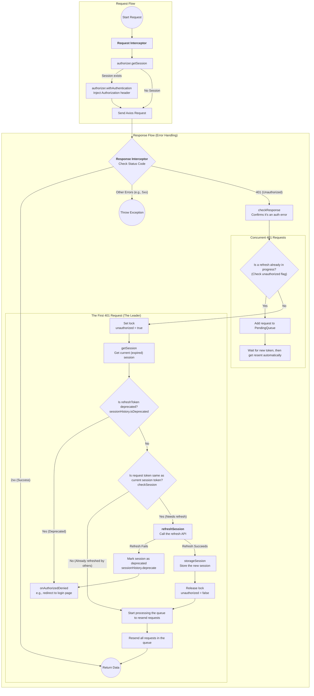

# axios-annotations

<p align="left">
  <b>English</b> | <a href="./README.md">简体中文</a>
</p>

[](https://www.npmjs.com/package/axios-annotations)
[](https://github.com/sitorhy/axios-annotations/blob/master/LICENSE)

---
A declarative `API` configuration framework for Axios with TypeScript support.

> The core design philosophy is to completely separate the **declaration of request construction** from the **provision of business data**. You no longer need to manually assemble `URL`s, headers, and request bodies. Instead, you use decorators to "declare" how a request should be built.

# Decorator Availability

| Decorator | Availability | Description |
| :--- | :--- |:---|
| `@RequestConfig` | Class / Method | Sets `axios` request configuration (e.g., `signal`). |
| `@RequestMapping` | Class / Method | Defines the `URL` path and `HTTP` method. |
| `@RequestWith` | Method | Redirects the `Config` used by a method. |
| `@RequestBody` | Method | Marks a parameter as the request body. |
| `@RequestHeader` | Method | Marks a parameter to be sent as a request header. |
| `@RequestParam` | Method | Marks a parameter to be sent as a `URL` query parameter. |
| `@PathVariables` | Method | Marks a parameter as a `URL` path variable. |

---

# Usage

## Core Workflow

1.  **Declarative Construction**: Use decorators like `@RequestMapping` and `@RequestParam` to describe the static structure of a request.
2.  **Data Provision**: Your business method receives parameters and `return`s a plain `JavaScript` object assembled from these parameters. This object serves as the data source (`Data Source`) for all decorators.
3.  **Automatic Execution**: The framework intercepts your method calls, uses the rules defined by the decorators to extract data from the returned data source object, and automatically builds and executes the `axios` request.

## Creating a Configuration

The framework includes a default global configuration (pointing to `localhost:8080`), but it is highly recommended to create and manage your own configurations.

**Example:**

```ts
// config.ts
import { Config } from "axios-annotations";

export const localConfig = new Config({
    protocol: 'http',
    host: 'localhost',
    prefix: '', // Optional request prefix
    port: 5173
});
```

Inject the configuration into a service class using `@RequestConfig`. Note that the service class must extend `Service`.

```ts
import { localConfig } from "./config.ts";
import { Service, RequestConfig } from "axios-annotations";

@RequestConfig(localConfig)
export class DemoService extends Service {
    // ...
}
```

The request prefix can be specified in the `Config`'s `prefix` field or by using `@RequestMapping` on the service class.

## @RequestMapping

-   **On a class**: Declares a common prefix for all requests within that service.
-   **On a method**: Declares the specific request path and `HTTP` method for a business method (the second argument, `method`, is required).

```ts
import { localConfig } from "./config.ts";
import { Expect, Service, RequestConfig, RequestMapping } from "axios-annotations";

@RequestConfig(localConfig)
@RequestMapping("/api")
export class DemoService extends Service {
    // Request URL: [GET] http://localhost:5173/api/foo
    @RequestMapping("/foo", "GET")
    foo() {
        return Expect<Record<any>>({});
    }

    // Request URL: [POST] http://localhost:5173/api/bar
    @RequestMapping("/bar", "POST")
    bar() {
        return Expect<Record<any>>({});
    }
}
```

## @RequestWith

When a service needs to request resources from different server addresses, you can use `@RequestWith` to redirect the `Config` for a specific method.

**Example:** Requesting files from different servers:

```ts
import { Config, Expect, Service, RequestConfig, RequestMapping, RequestWith } from "axios-annotations";

const config = new Config({
    protocol: "http",
    host: "localhost",
    prefix: "/resources",
    port: 5173
});

const config2 = new Config({
    protocol: "http",
    host: "localhost",
    prefix: "/data",
    port: 5173
});

@RequestConfig(config)
export class FileService extends Service {
    @RequestMapping("/test1.json", "GET")
    getFile() {
        // Request URL: [GET] http://localhost:5173/resources/test1.json
        return Expect<any>({});
    }

    @RequestWith(config2)
    @RequestMapping("/test2.json", "GET")
    getFile2() {
        // Request URL: [GET] http://localhost:5173/data/test2.json
        return Expect<any>({});
    }
}
```

**Note**: If a service class has a common prefix declared with `@RequestMapping`, a method decorated with `@RequestWith` will still have this prefix appended. If you need to use a completely different prefix for a method, you should either move the common prefix to the `Config`'s `prefix` field or remove the class-level `@RequestMapping`.

```ts
// ...config and config2 definitions

@RequestConfig(config)
@RequestMapping("/api") // Class-level prefix
export class FileService extends Service {
    // ...
    
    @RequestWith(config2)
    @RequestMapping("/test2.json", "GET")
    getFile2() {
        // Request URL: [GET] http://localhost:5173/data/api/test2.json (prefix is appended)
        return Expect<any>({});
    }
}
```

## @RequestBody

Used to declare the data source for the request `body`.

-   **Default Behavior**: `@RequestBody()` is equivalent to `@RequestBody("body")`, both indicating that the `body` field from the data source should be used as the request body.
-   **Note**: Since request bodies have diverse formats and cannot be merged, multiple `@RequestBody` declarations on the same method will result in the last executed one taking precedence.

```ts
@RequestMapping("/files/package_graph.json", "POST")
@RequestBody()
getPackageGraph() {
    return Expect<Record<string, any>>({
        body: {
            version: '3.x',
            description: 'Sample data'
        }
    });
}
```

`@RequestBody` also supports an extended syntax for specifying a static value or custom logic.

-   **Static Value**:

```ts
@RequestMapping("/files/package_graph.json", "POST")
@RequestBody({
    value: {
        version: '3.x',
        description: 'Sample data'
    }
})
getPackageGraph() {
    return Expect<Record<string, any>>({});
}
```

-   **Custom Logic**:

```ts
@RequestMapping("/files/package_graph.json", "POST")
@RequestBody({
    value: function () {
        return {
            version: '3.x',
            description: 'Sample data 2'
        };
    }
})
getPackageGraph() {
    return Expect<Record<string, any>>({});
}
```

## @RequestHeader

Declares how to source values for request `header`s. It supports the following methods:

1.  **From Data Source Field**: `@RequestHeader(key: string, required?: boolean = true)`. The second argument, `required`, defaults to `true`. If the value from the data source is empty (`null`/`undefined`/`''`), a header with an empty string value will be sent.
2.  **Static Value**: `key` is required.
3.  **Custom Logic**: `key` is required.

Headers can be merged. Here is a comprehensive example:

```ts
@RequestConfig(config)
export class FileService extends Service {
    // ...
    // 1. From data source field, required
    @RequestHeader("Custom-Header", true)
    // 2. Static value
    @RequestHeader({
        key: "Custom-Header-2",
        value: "static-header-value"
    })
    // 3. Custom logic
    @RequestHeader({
        key: "Custom-Header-3",
        value: function (source: Record<string, any>) {
            return source.num1 + source.num2;
        }
    })
    getPackageGraph() {
        return Expect<Record<string, any>>({
            "Custom-Header": "header-value-from-source",
            num1: 100,
            num2: 200
        });
    }
}
```

Generated headers:
```
Custom-Header: header-value-from-source
Custom-Header-2: static-header-value
Custom-Header-3: 300
```

## @RequestParam

Declares how to source values for `URL` `Query Param`s. The usage is similar to `@RequestHeader`:

1.  **From Data Source Field**: `@RequestParam(key: string, required?: boolean = false)`. `required` defaults to `false`. If the value is empty, it will not be appended to the `URL`.
2.  **Static Value**: `key` is required.
3.  **Custom Logic**: `key` is required.

```ts
@RequestConfig(config)
export class FileService extends Service {
    @RequestMapping("/demo.json", "POST")
    @RequestParam("param1")
    @RequestParam("param2")
    @RequestParam({
        key: "sum",
        value: (source) => Number(source['param1']) + Number(source['param2'])
    })
    @RequestParam({ key: 'static', value: 'foo' })
    @RequestBody()
    getJson() {
        return Expect<Record<string, any>>({
            param1: '114',
            param2: '514',
            body: { /* ... */ }
        });
    }
}
```

Generated `URL` from calling `getJson()`:
```text
http://localhost:5173/resources/demo.json?static=foo&sum=628&param2=514&param1=114
```

## @PathVariables

Used to replace placeholders in the `URL` path.

-   **Usage**: `@PathVariables(fieldName?: string)` or `@PathVariables({ value: ... })`.
-   **Data Source**: The value must be a `PlainObject`. If `fieldName` is not specified, it matches keys from the root of the method's data source.
-   **Merging**: Data sources from multiple `@PathVariables` declarations are merged.

```ts
@RequestConfig(config)
export class FileService extends Service {
    @RequestMapping("/files/{fileName}?a={a}&c={c}&e={e}", "GET")
    @PathVariables() // No field specified, sources from the root data source (matches "fileName")
    @PathVariables({
        value: (source) => ({ a: 100, c: 300, d: source.d })
    })
    @PathVariables('pathVariablesKey') // Sources from the "pathVariablesKey" field (matches "e")
    getFileInfo(fileName: string) {
        return Expect<Record<string, any>>({
            fileName,
            d: 400,
            pathVariablesKey: { e: 500 }
        });
    }
}
```

**Difference from `@RequestParam`**:
-   `@RequestParam` passes values to `axios`'s `params` object for serialization. `@PathVariables` directly converts values to strings to replace placeholders.
-   Path placeholders are fixed; there is no "optional" logic.
-   If a path variable value is not a primitive type, it will be `JSON.stringify`'d. If this fails, it becomes `"undefined"`.

## @RequestConfig

-   **On a class**: Sets the base configuration for all methods in the service.
-   **On a method**: Merges or overrides the `AxiosRequestConfig` for a specific method. This is useful for dynamically configuring a large number of parameters or headers.

```ts
@RequestConfig(config)
export class FileService extends Service {
    @RequestMapping("/test1.json", "GET")
    @RequestConfig({
        headers: { 'X-Source': 'class', 'Authorization': 'Bearer token' }
    })
    @RequestConfig((source) => ({
        headers: { 'Token1': '1' },
        params: source.params
    }))
    getData() {
        // Request URL: http://localhost:5173/data/test1.json?a=1&b=2
        // Headers:
        // X-Source: class
        // Token1: 1
        // Authorization: Bearer token
        return Expect<Record<string, any>>({
            params: { 'a': 1, 'b': 2 }
        });
    }
}
```

`@RequestConfig` can also be used to inject an `AbortController`'s `signal` to cancel requests. This is particularly useful in `React 18+` Strict Mode (`<React.StrictMode>`) to prevent `useEffect` from sending a request twice due to re-mounting.

**Example**: Automatically canceling a request on component unmount.

```ts
// Service Definition
@RequestConfig(config)
export class FileService extends Service {
  @RequestMapping("/test1.json", "GET")
  @RequestConfig((source) => ({ signal: source.signal }))
  getData(signal: AbortSignal) {
    return Expect<Record<string, any>>({ signal });
  }
}

// React Component Logic
import { ApiManager } from './api-manager';
import { useEffect } from "react";

export function MyComponent() {
  useEffect(() => {
    const controller = new AbortController();
    ApiManager.fileService.getData(controller.signal);

    return () => controller.abort(); // Called on component unmount
  }, []);

  return <div>AbortController Demo</div>;
}
```

## Expect

Function signature reference:
```typescript
export default function Expect<T, D = AxiosPromise<T>>(params: any): D;
```

Due to a `TypeScript` limitation, decorators cannot change a method's return type at compile time. While your method's code returns a plain object (the data source), the framework actually returns an `AxiosPromise` at runtime. `Expect<T>` bridges this gap. It acts as a type bridge, using a type assertion to bypass the static check, allowing you to get full type safety and `IDE` autocompletion when calling the method.

The generic type `T` in `Expect<T>` is crucial: it **defines the type of the `data` you expect in the server's response**.
-   If the API returns a specific `JSON` object, you should define an interface `MyData` and use `Expect<MyData>(...)`.
-   If the API returns plain text, you should use `Expect<string>(...)`.

## Environments without Decorator Support

```ts
import { RequestBuilder } from "axios-annotations";
import { config } from './config';

async function foo() {
  const response = await new RequestBuilder()
    .param({
      key: 'param',
      value: (source) => source.param
    })
    .buildWith(config, "/demo.json", "GET", { param: 666 });

  console.log(response.data);
}
```

## Runtime Environments

### WeChat Mini Program Configuration

Update the developer tools to support decorator syntax.

The `TypeScript` environment in WeChat Mini Program developer tools does not support decorator compilation, but the `JavaScript` environment does. By changing the file extension of your `API` configuration files from `*.ts` to `*.js`, you can bypass this limitation. In your local settings, enable "Compile JS to ES5" and import as usual.

> **Bug in Developer Tools**: `npm` build fails in `TS` environment.
>
> Add the following to your `project.config.json` under `setting`:
>
> ```json
> {
>     "packNpmManually": true,
>     "packNpmRelationList": [
>       {
>         "packageJsonPath": "./package.json",
>         "miniprogramNpmDistDir": "./miniprogram/"
>       }
>     ]
> }
> ```
>
> Then, in the developer tools, go to `Project` -> `Reopen Project` and build `npm`.

**Installing a third-party `axios` implementation:**

+ **Option 1: Use an adapter, `axios-miniprogram-adapter`**

  `axios` needs to be downgraded to avoid errors:
  ```shell
  npm install axios@0.26.1
  npm install axios-miniprogram-adapter
  ```
  If the developer tools report a `module is not defined` error, add the missing component declarations at the top of `app.js`:
  ```javascript
  import { Config, Service, Expect, ... } from "axios-annotations";
  ```

+ **Option 2: Use a third-party implementation, e.g., `axios-miniprogram`**

  ```shell
  npm install axios-miniprogram
  ```
  If the `npm` build fails, you can directly copy the directory from `node_modules`.
  Implement and configure `AxiosStaticInstanceProvider`. You can ignore any IDE warnings about the `provide` return type:
  ```javascript
  import mpAxios from 'axios-miniprogram';
  
  class ThirdAxiosStaticInstanceProvider extends AxiosStaticInstanceProvider {
      provide() {
          return mpAxios;
      }
  }
  
  const config = new Config({
      // ...
      axiosProvider: new ThirdAxiosStaticInstanceProvider(),
  });
  ```

# Plugins

## Custom Plugins
A plugin is a function that receives the `Config` object and the `axios` instance as arguments. For extensibility, it's often returned by a higher-order function. Plugins are injected when the `axios` instance is created within the `Config` object and should be configured in the `Config` constructor.

```typescript
import { Config } from "axios-annotations";
import type { AxiosInstance } from "axios";

export function ToastPlugin(fnToast) {
    return function (config: Config, axios: AxiosInstance) {
        axios.interceptors.response.use(
            (response) => response,
            (error) => {
                fnToast(error);
                return Promise.reject(error);
            }
        );
    }
}

// Configure the plugin
new Config({
    plugins: [
        ToastPlugin((error) => {
            console.error(`Request Failed: [${error.response?.status}] ${error.config?.url}`);
        })
    ]
});
```

## Authorization Plugin (Optional)
This plugin automatically adds authorization information to requests (e.g., `Bearer Token` headers). It is adapted for the `OAuth2` standard by default.

+ **Define a Session Storage Handler**
```ts
import { SessionStorage } from "axios-annotations/plugins/auth";

class WebSessionStorage extends SessionStorage {
  async set(key: string, value: any): Promise<void> {
    sessionStorage.setItem(key, JSON.stringify(value));
  }
  // ... implement get and remove
}
```

+ **Instantiate and Export an `Authorizer` Object**
> The exported `Authorizer` object is used to write session information after the initial login (by calling `storageSession`) and to retrieve the session (`getSession`).

```ts
import { Authorizer, type BasicSession } from "axios-annotations/plugins/auth";

class LocalAuthorizer extends Authorizer {
  constructor() {
    super();
    this.sessionStorage = new WebSessionStorage();
  }

  async refreshSession(session: BasicSession): Promise<any> {
    const response = await new OAuthService().refreshToken({
      refresh_token: session.refresh_token
    });
    // Assemble and return the new session object. 
    // onAuthorizedDenied will catch runtime exceptions from this method.
    return { ...response.data };
  }

  withAuthentication(request: InternalAxiosRequestConfig, session: BasicSession) {
    // Default implementation is used here.
    super.withAuthentication(request, session);
  }

  async onAuthorizedDenied(error: unknown): Promise<void> {
    // This is the exception thrown by refreshSession.
    console.error(error); 
    // Calling invalidateSession triggers onSessionInvalidated.
    await this.invalidateSession();
  }

  onSessionInvalidated() {
    // Redirect to the login page or home page.
    window.history.replaceState({}, document.title, window.location.pathname);
  }
}

export const authorizer = new LocalAuthorizer();
```

+ **Define Configurations for Authorization and Business Services**
The authorization service (`OAuthService`) should be separate from business services to avoid header conflicts. The example `OAuthService` is adapted for `spring-boot-starter-oauth2-authorization-server 4.0.x` and is for reference only.

```ts
import AuthorizationPlugin from "axios-annotations/plugins/auth";

const oauthConfig = new Config({ /* ... for auth server ... */ });

const businessConfig = new Config({
  protocol: 'http',
  host: 'localhost',
  port: 8080,
  plugins: [
    AuthorizationPlugin(authorizer)
  ]
});

@RequestConfig(oauthConfig)
export class OAuthService extends Service {
  // ... methods like generateVerifier, getCodeChallenge, getToken, refreshToken
}

@RequestConfig(businessConfig)
export class BusinessService extends Service {
  // ... business API methods
}
```

+ **Login and Write Authorization Information**
```ts
const oauthService = new OAuthService();

async function handleLoginButtonClick() {
  // ... PKCE flow to get the authorization code ...
  window.location.href = `http://localhost:8080/oauth2/authorize?${params.toString()}`
}

// On the callback page (e.g., home page)
useEffect(() => {
  const urlParams = new URLSearchParams(window.location.search);
  const code = urlParams.get('code');
  // ...
  if (code && verifier) {
    oauthService.getToken({ /* ... */ }).then((response) => {
      const { access_token, refresh_token } = response.data;
      authorizer.storageSession({ access_token, refresh_token });
      // ... clear code from URL
    });
  }
  // ...
}, []);
```

## Authorizer
**Session Object Structure:**
```ts
export type BasicSession = {
  access_token?: string;
  accessToken?: string;
  token?: string;
  refreshToken?: string;
  refresh_token?: string;
} & Record<string, any>;
```
Non-standard authorization credentials must be mapped to one or more of `access_token`, `accessToken`, or `token`. For flows that do not support `refreshToken`, a non-repeating random value can be used.

The only methods that **must** be overridden are `onAuthorizedDenied` and `refreshSession`.

**Method Descriptions:**

+ `invalidateSession(): Promise<void>`
> Deletes session information and triggers the `onSessionInvalidated` callback.
+ `onSessionInvalidated(): void`
> Can be overridden to redirect to the login/home page.
+ `onAuthorizedDenied(error: unknown): Promise<void>`
> Handles runtime exceptions from `refreshSession` (e.g., HTTP 401/500), which typically means the `refreshToken` has expired and re-login is required. You should always override this method to perform cleanup and must call `invalidateSession`.
+ `refreshSession(session: BasicSession): Promise<BasicSession | null>`
> Must be overridden. It receives the current session and should use `session.refreshToken` to obtain a new `accessToken`. Return the new session object, and the plugin will persist it automatically. For flows without refresh tokens, return `null` and call `invalidateSession`, or throw an exception to trigger `onAuthorizedDenied`.
+ `checkResponse(response: AxiosResponse): boolean`
> Checks if a request failed due to an authorization error. The default implementation **only checks if the status code is `401`**. Returning `false` indicates an expired authorization and triggers the refresh flow.
+ `checkSession(request: InternalAxiosRequestConfig, session: BasicSession): boolean`
> The default implementation compares the `accessToken` in the request header (written by `withAuthentication`) with the `accessToken` of the current expired session. If they are equal, it returns `false` to proceed with the refresh.
+ `withAuthentication(request: InternalAxiosRequestConfig, session: BasicSession): void`
> Intercepts requests to inject session information. The default implementation writes the `accessToken` to the `Authorization: Bearer ${accessToken}` header.
+ `getSession(): Promise<BasicSession>`
> Retrieves the session object, typically by calling `sessionStorage.get`.
+ `storageSession(session: BasicSession | null)`
> Persists the session object, typically by calling `sessionStorage.set`.

---

# Authorization Flow

The following flowchart describes how the `AuthorizationPlugin` calls the methods of the `Authorizer` interface during session expiration and authentication.


