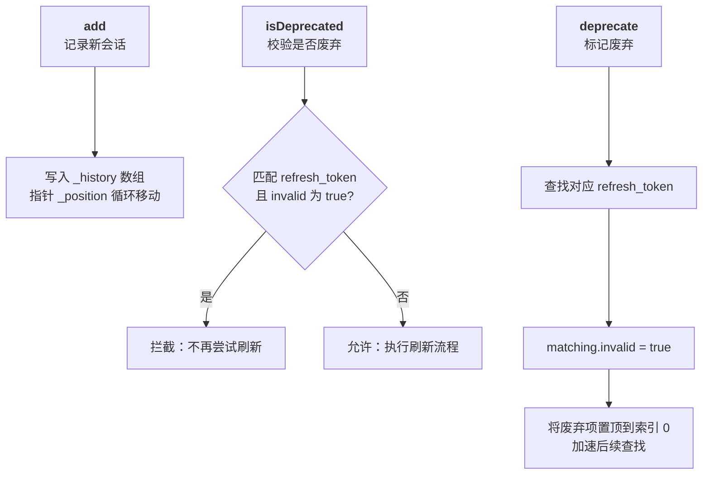

```mermaid
graph TD
    Add[<b>add</b><br/>记录新会话] --> Circular[写入 _history 数组<br/>指针 _position 循环移动]
    
    Check[<b>isDeprecated</b><br/>校验是否废弃] --> Match{匹配 refresh_token<br/>且 invalid 为 true?}
    Match -- "是" --> ReturnTrue[拦截：不再尝试刷新]
    Match -- "否" --> ReturnFalse[允许：执行刷新流程]
    
    Deprecate[<b>deprecate</b><br/>标记废弃] --> Find[查找对应 refresh_token]
    Find --> Mark[matching.invalid = true]
    Mark --> Swap[将废弃项置顶到索引 0<br/>加速后续查找]
```